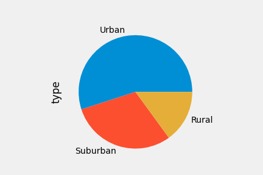
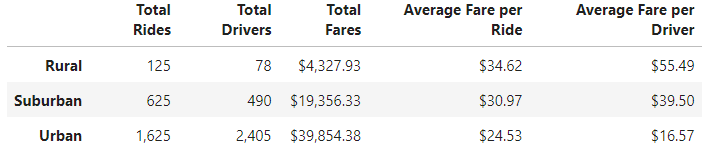

# PyBer_Analysis
Analysis of PyBer ride sharing data by city type using pandas and matplotlib

## Project Outline:

* Using Python and Pandas, create a summary DataFrame of the ride-sharing data by city type. 
* Then, using Pandas and Matplotlib, create a multiple-line graph that shows the total weekly fares for each city type. 
* Create a written report that summarizes how the data differs by city type and how those differences can be used by decision-makers at PyBer.

 

## Results:

 

**Distribution of city types:** 
    

  - Most PyBer ride shares took place in Urban cities. Urban areas have a higher population density so this is a logical conclusion to make from our above chart derived from our rideshare dataset.

 

**Ride Statistics by Type of City:**
 
 

 

- There is a evident correlation between city type and total fares.
- Rural cities have a larger total number of rides.

   - Subsequently, each ride costs less.

 

- Suburban and Rural cites have a smaller amount of rides and drivers resulting in a higher average fare per ride and driver.
- Rural cities have the highest prices.

 

# Summary:

 

 

**The average fare per drive is lowest in the Urban areas and highest in the Rural areas. The PyBer rideshare data suggests a negative correlation between the total number of rides and the average fare per ride. The more rides in an area the less each ride costs. Oppositely, the lesser amount of rides, the ride fare increases. Urban areas are very developed, resulting in its the higher demand for rides and lower fare prices**

 

## Resources:

> All data used in this analysis can be found inside of the Resources and Analysis folder.

>Software: Python 3.7, Anaconda, Jupyter Lab